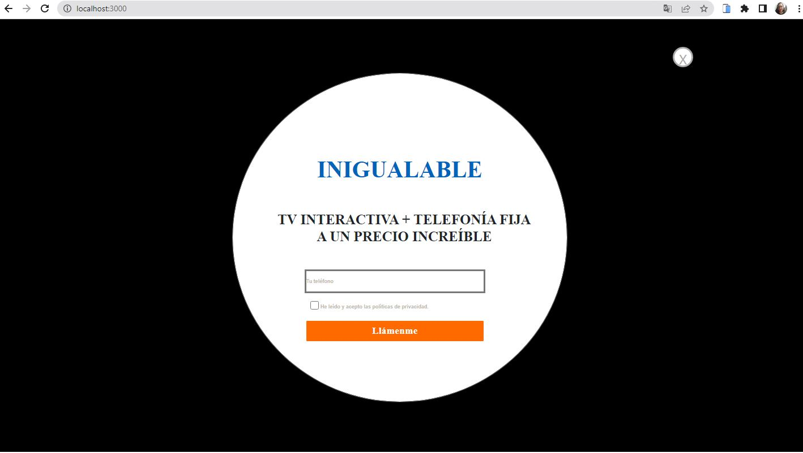
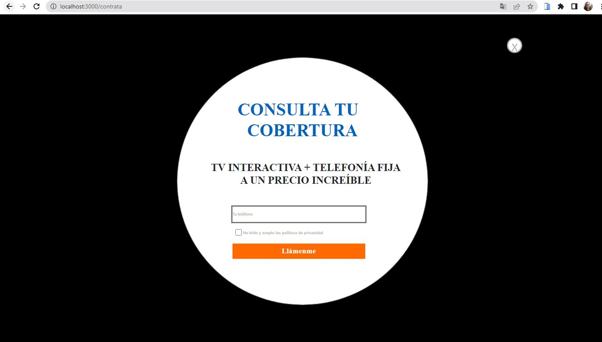

# PRUEBA TÉCNICA | DESARROLLAD@R WEB - FRONT END - CONVERTIA

# 

## Índice

* [1. ¿Quien es Convertia? ](#1-Quien-es-convertia)

* [2. Descripción Prueba Técnica ](#1-definición-del-producto)
* [3. Desarrollo de la Prueba](#3-Desarrollo-de-la-Prueba)
* [4. Instrucciones detalladas de cómo instalar las dependencias y ejecutar el proyecto)](#4-Instrucciones-detalladas-de-cómo-instalar-las-dependencias-y-ejecutar-el-proyecto)
* [5. URL del repositorio git (Github, Gitlab, Bitbucket))](#5-URL-del-repositorio-git)

# Parte Uno 

### 1. Quién es Convertia

Empresa digital y tecnológica especializada en marketing y ventas.

Provee una plataforma tecnológica integral potenciada con  inteligencia artificial y desarrollada por nuestro partner estratégico inConcert, líder en soluciones omnicanales para centros de contacto.

Logran una adopción exitosa y el máximo rendimiento de la
tecnología gracias al acompañamiento personalizado de su
equipo de consultores.

+ Al seleccionar un producto de la vista de producto sus c

### 2. Descripción Prueba Técnica

+ Desarrollar una página web, maqueta, aplicando los estilos y crea animaciones tanto en botones, iconos, textos, navegación, todo lo que se cosidere oportuno para conseguir una página web lo más atractiva de cara al usuarioi.

+ A partir del siguiente Diseño

+ El diseño de la página se ha creado en su versión desktop, pero es primordial que tomes en cuenta la versión mobile, ya que el mayor porcentaje de nuestro tráfico procede desde estos dispositivos. Por lo tanto pedimos los dos formatos de forma obligatoria, tanto mobile como desktop.

+ ¿Cómo será la navegación?
La navegación consiste en una página HOME con un selector a un par de ocpiones. Al generar el click en “Contrata hoy” se lanza la pantalla “Prueba Técnica_Contrata”, en cambio si se genera click en “Eres cliente y necesitas ayuda” te llevará a la página “Prueba Técnica_ATC”. Estando en la Home, si generas el click en el icono de teléfono deberá lanzar la pantalla “Prueba técnica_pop up01”. Y estando en la página de “Prueba Técnica_Contrata”, si generas click en el icono de ubicación te llevará a “Prueba Técnica_Pop up_cobertura".

### 3. Desarrollo de la Prueba

A lo largo de 5 días llevé a cabo la presente prueba técnica.

+ Planeación 

+ Definición de tecnología a usar

Debido a que la empresa Convertia actualmente usan JavaScript decidí llevar a cabo la presente prueba con esta tecnología.

Por medio de JavaScript realicé la maquetación de la presente Single Page Application adicional utilicé HTML y CSS.

+ App construida

Versión Desktop

Versión Mobile

##### 4. Instrucciones detalladas de cómo instalar las dependencias y ejecutar el proyecto

+ Crear una repositorio local.
+ Dar fork al repositorio [Interfaz](https://github.com/lylyzyta/Convertia)
+ Crear un carpeta local.
+ Dar clone al proyecto en git.
+ Abrir carpeta local con visual studio code.
+ En terminal ingresar git clone https://github.com/lylyzyta/Convertia
+ npm start.

##### 5. URL del repositorio GitHub
[Interfaz](https://github.com/lylyzyta/Convertia)

# Parte 2

¿Cuánto tiempo tardas en las siguientes tareas?

1. https://totalplayplanes.mx/s/totalplay-promociones

Aproximadamente 2 semanas.

2. https://movistar-promociones.pe/s/movistar-total/movistar-movil.html

Aproximadamente 1.5 semanas.

3. https://www.hyundaipromociones.es/

Aproximadamente 2 semanas.

4. https://mundointernet.cl/p/td

Aproximadamente 2.5 semanas.

Cabe señalar que los tiempos mencionados anteriormente son calculados sin usar ningún tipo de framework adicional a JavaScript, ya que al utilizar más herramientas el tiempo de entrega sería menor.

